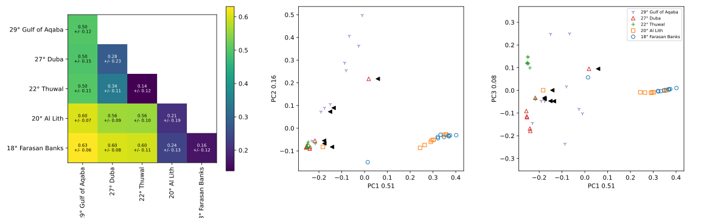

# Rossbach & Hume et al. 2020
This repo contains the Python script and associated data to generate the ordination
and between-sample distance figure in the manuscript.

The generated figure is:

The following data files are required to be in the same directory as rossbach_hume_2020.py
- 109_20200609_2020-06-09_11-59-06.357078.profiles.absolute.abund_and_meta.txt
- 109_20200609_2020-06-09_11-59-06.357078.seqs.absolute.meta_only.txt
- 2020-06-09_11-59-06.357078_braycurtis_sample_distances_A_sqrt.dist

These files will be uploaded to this repository upon publication of the manuscript.
If they have not been uploaded please get in touch.

A .yml conda environent file has been provided for ease of setup.
Create a new conda environment from which to run rossbach_hume_2020.py using:

`conda env create -f rossbach_env.yml`